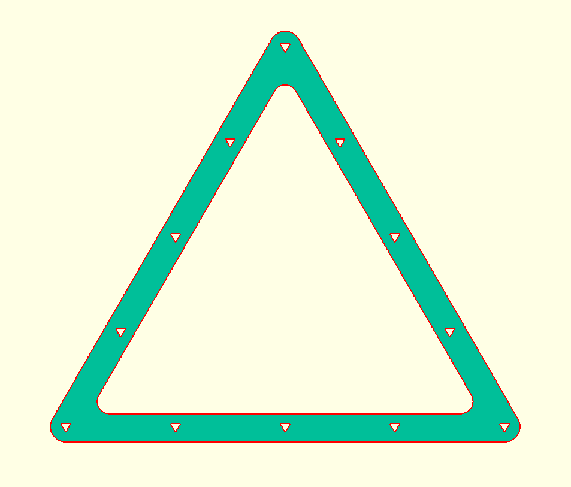
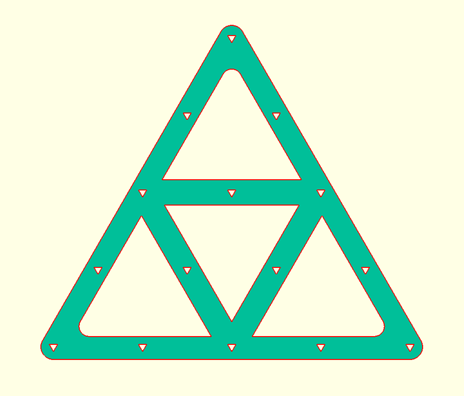

# Pool Racking template

Use a laser cut machine to cut 2 racking template from A3 paper. Laminating pouches might also work, but I haven't tried it myself.

### Hole distance

The distance between each hole can be adjusted using the `hole_dist` variable. A standard American Pool ball size is 2 1/4 inch, which is roughly 57.15mm. I did some experimentation and found 56.85mm works pretty well.

